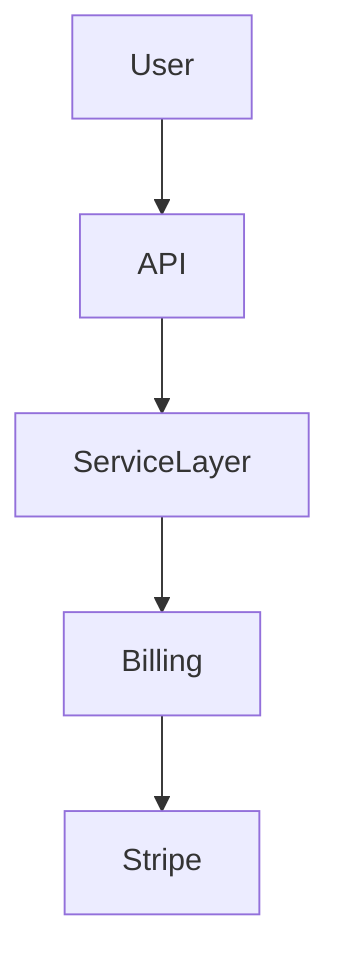

<instruction id="generate-architecture-diagram">
  Create architectural diagrams to illustrate relationships between systems, services, models, or user flows.

  <rules>
    <rule>Diagrams must reflect structure, interaction, or behavior — never code or syntax.</rule>
    <rule>Only use `mermaid`, `text`, or other permitted diagram formats.</rule>
  </rules>

  <directives>
    <directive>Use `graph TD`, `sequenceDiagram`, or layered ASCII blocks for visual clarity.</directive>
    <directive>Include identifiers, arrows, and grouping to represent modules or flows semantically.</directive>
    <directive>Do NOT embed logic, examples, or pseudocode inside diagrams.</directive>
  </directives>

  <examples>
    <example>
      <code>

      </code>
    </example>
    <example>
      <code>
```text
[Client] --> [REST API] --> [AuthService]
                    ↘︎        ↘︎
                  [DB]      [Cache]
```
      <code>
    </example>
  </examples>
</capability>
